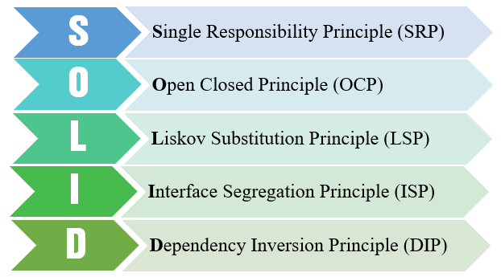
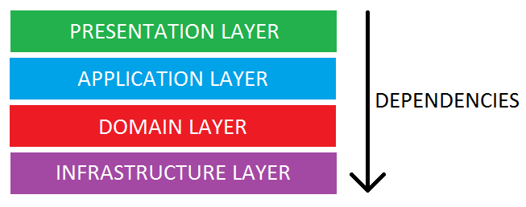
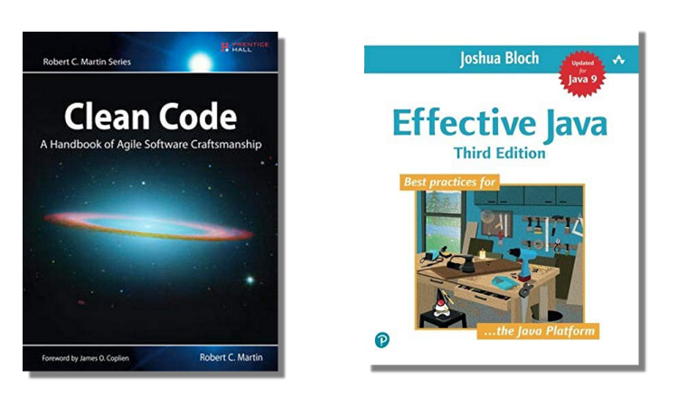

# Clean code

<!-- .slide: class="page-title" -->


## Table of contents

<!-- .slide: class="toc" -->

- **[Clean code](#/1)**
- [Testing](#/2)
- [Maven](#/3)
- [Spring Core](#/4)
- [Spring MVC](#/5)
- [Spring Security](#/6)
- [Spring Data](#/7)
- [Spring Batch](#/8)
- [Spring Boot](#/9)


## Building a SOLID backend

A set of five design principles to make more robust, clean, understandable code.

<figure>
    
</figure>

Introduced by Uncle Bob in 2000 (Design Principles and Design Patterns)


## Single responsibility principle

> "A class should only have a single responsibility, that is, only changes to one part of the software's specification should be able to affect the specification of the class."

 - Minimises dependencies
 - Helps keep code complexity down
 - Smaller classes !


## Open–closed principle

> "Software entities should be open for extension, but closed for modification."

- *Open for extension* – This means that the behavior of the module can be extended. As the requirements of the application change, we are able to extend the module with new behaviors that satisfy those changes. In other words, we are able to change what the module does.
- *Closed for modification* – Extending the behavior of a module does not result in changes to the source or binary code of the module. The binary executable version of the module, whether in a linkable library, a DLL, or a Java .jar, remains untouched.


## Liskov substitution principle

> "Objects in a program should be replaceable with instances of their subtypes without altering the correctness of that program." See also design by contract.

- Reference the most abstract possible class (eg: List instead of ArrayList. Maybe Collection ?).
- When overriding a class, never break its contract.


## Interface segregation principle

> "Many client-specific interfaces are better than one general-purpose interface."

- Interfaces provide layers of abstraction that simplify code and create a barrier preventing coupling to dependencies.
- Never be afraid to introduce new interfaces. 
- Reference these interfaces whenever possible, not the implementors.


## Dependency inversion principle

> "One should depend upon abstractions, not concretions."

- High-level modules should not depend on low-level modules. Both should depend on abstractions (e.g. interfaces).
- Abstractions should not depend on details. Details (concrete implementations) should depend on abstractions.


## Packaging your application

Split your basecode according to the technical role of your classes

<figure>
    
</figure>

- The *presentation layer*: UI logic (controllers)
- The *application layer*: Business logic (services)
- The *domain layer*: Model (entities)
- The *infrastructure layer*: Persistence (DAOs, repositories)


## Packaging your application

- All the dependencies go in one direction, from presentation to infrastructure.
- No logic related to one layer’s concern should be placed in another layer. For instance, no domain logic or database queries should be done in the UI.


<!-- .slide: class="page-tp1" -->


## Packaging your application

Industrialize your build: Use industry standard tools to manage the complete flow of your build:

- File generation
- Compilation
- Test execution
- Packaging
- Anything that needs automatisation !

<figure>
    
</figure>


## Inversion of control (IOC)

Instantiating components yourself is bad !

- Manage all the boilerplate yourself (singletons, lifecycle)
- Introduces coupling
- Adds bloat to your classes


## Inversion of control (IOC)

Wouldn't it be better to have the framework do that for you ?

- Cleaner, smaller code: Classes are focused on their job
- Making it easier to switch between different implementations
- Greater modularity of a program
- Greater ease in testing (allows mocking)


## Dependency Injection

Dependency injection is a pattern through which to implement IoC.

The act of connecting objects with other objects, or "injecting" objects into other objects, is done by an assembler rather than by the objects themselves.

Before :

```java
public class Store {
    private Item item;
  
    public Store() {
        item = new ItemImpl1();    
    }
}
```

After :

```java
public class Store {
    private Item item;
    public Store(Item item) {
        this.item = item;
    }
}
```


## Dependency Injection

By *constructor*
```java
public class Store {
    private Item item;
    public Store(Item item) {
        this.item = item;
    }
}
```

By *accessor* (setter)
```java
public class Store {
    private Item item;
    
    public setItem(Item item) {
        this.item = item;
    }
}
```

By *annotation*
```java
public class Store {

    @Inject
    private Item item;
}
```


## Recommended reading

- **Clean Code**: A Handbook of Agile Software Craftsmanship (Robert C. Martin)
- **Effective Java** (Joshua Bloch)

<figure>
    
</figure>


<!-- .slide: class="page-questions" -->
