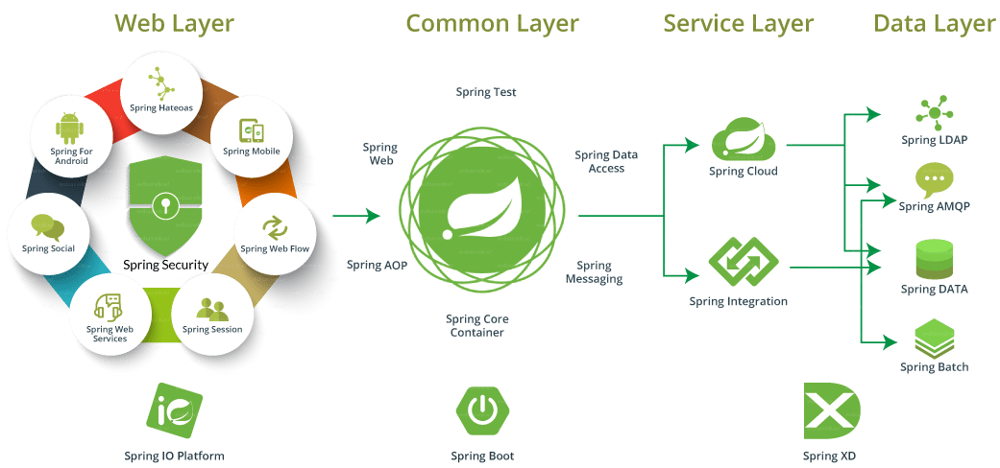

# Spring Core

<!-- .slide: class="page-title" -->


## Table of content

<!-- .slide: class="toc" -->

- [Clean code](#/1)
- [Testing](#/2)
- [Maven](#/3)
- **[Spring Core](#/4)**
- [Spring MVC](#/5)
- [Spring Security](#/6)
- [Spring Data](#/7)
- [Spring Batch](#/8)
- [Spring Boot](#/9)


## Spring

- Open source framework first released in 2002
- An industry standard you're bound to use again and gain on Java projects
- At its core, an *inversion of control container* that acts as the glue between all your application components
- But it's much more !

<figure>
    
</figure>


## The Spring ecosystem

Many optional additional modules to handle all of the technical features you may need

<figure>
    
</figure>


## Spring Core: Inversion of control container

Spring Core :

- handles the lifecycle of your components (creation and destruction)
- ensures the correct scope for your objects (singleton or request/session boundaries)
- performs dependency injection efficiently (even handles interdependant objects)
- is very flexible (injection thru constructors, setters or annotations)

```xml
<dependency>
    <groupId>org.springframework</groupId>
    <artifactId>spring-core</artifactId>
</dependency>
```


## Spring Core: The application context

- The application context is a "bag" which will contain all of the managed components that compose your application
- An application typically containes one context, but several contexts may cohabit either in a sealed or parent/child relationship
- Upon startup, a Spring application initializes the context, which means all managed components are discovered, instanciated and dependency injection is performed wherever needed

```xml
<dependency>
    <groupId>org.springframework</groupId>
    <artifactId>spring-context</artifactId>
</dependency>
```


## Spring Core: Configuration

The old way: XML files

```xml
<?xml version="1.0" encoding="UTF-8"?>
<beans xmlns="http://www.springframework.org/schema/beans"
    xmlns:xsi="http://www.w3.org/2001/XMLSchema-instance" xmlns:context="http://www.springframework.org/schema/context"
    xsi:schemaLocation="http://www.springframework.org/schema/beans 
    http://www.springframework.org/schema/beans/spring-beans.xsd 
    http://www.springframework.org/schema/context 
    http://www.springframework.org/schema/context/spring-context.xsd">
     
    <bean id="ldapHelper" class="com.zenika.myapp.helpers.ldap.LdapHelper"/>
   
    <bean id="operations" class="com.zenika.myapp.services.OperationService">
         <property name="myProperty" value="myValue"/>
    </bean>
</beans> 
```

```java
public class MainApp {
   public static void main(String[] args) {
      ApplicationContext context = 
            new ClassPathXmlApplicationContext("configuration.xml");
      OperationService service = 
            (OperationService) context.getBean(OperationService.class);
      service.doSomething();
   }
}
```


## Spring Core: Configuration

The new way: Java *@Configuration* files

- Leverages your IDE: autocompletion and error detection
- More flexible: instanciate and manipulate anything, any way you want. It's real Java !

```java
@Configuration
public class MyConfig {

    @Bean
    public LdapHelper ldapHelper() {
        return new LdapHelper();
    }

    @Bean
    public OperationService operations() {
        OperationService service = new OperationService();
        service.setMyProperty("myValue");
        return service;
    }
} 
```

```java
      ApplicationContext context = 
            new AnnotationConfigApplicationContext(MyConfig.class);
```


## Spring Core: Configuration

- *@Bean* declarations may depend on other beans.
- You can retrieve the instances you need by simply asking for them as arguments.
- Spring will provide them automatically

```java
@Configuration
public class MyConfigOne {
    @Bean
    public LdapHelper ldapHelper() {
        return new LdapHelper();
    }
}

@Configuration
public class MyConfigTwo {
    @Bean
    public SomeService someService(LdapHelper ldapHelper) {
        return new SomeService(ldapHelper);
    }
}
```


## Spring Core: Configuration

- Alternatively if your dependency is in the same configuration, you may call directly the corresponding method
- Spring "magic" will still ensure your bean is a singleton

```java
@Configuration
public class MyConfig {
    @Bean
    public LdapHelper ldapHelper() {
        return new LdapHelper();
    }

    @Bean
    public SomeService someService() {
        return new SomeService(ldapHelper());
    }

    @Bean
    public AnotherService anotherService() {
        // still the same instance of ldapHelper !
        return new AnotherService(ldapHelper()); 
    }
}
```


## Property injection

- Hard-coding property values in your configuration is hardly a best pratice.
- It's better to define configuration files, and have Spring inject your configuration data into your beans.

```shell
# configuration.properties file in classpath
operations-property=myValue
```

```java
@Bean
public static PropertySourcesPlaceholderConfigurer properties() {
    PropertySourcesPlaceholderConfigurer placeholderConfigurer = new PropertySourcesPlaceholderConfigurer();
    Resource[] resources = new ClassPathResource[]{new ClassPathResource("configuration.properties")};
    placeholderConfigurer.setLocations(resources);
    return placeholderConfigurer;
}
```

```java
public class OperationService {
    @Value("${operations-property}")
    private String myProperty;
}
```


## A magical annotation: @Autowired

- This annotation is used to ask Spring to perform a dependency injection
- It can be used on setters, constructors or fields
- Upon class instantiation, Spring will fulfill all @Autowired dependencies, and crash if no suitable dependency is found
- ... unless  *@Autowired(required=false)* is specified


## @Autowired on setters

```java
public class StoreService {
    private Item item;
    
    @Autowired
    public setItem(Item item) {
        this.item = item;
    }
}
```

This is the "old" way

- Pros: Flexible. Not all setters need to be required
- Cons: Verbose: needs a bunch of setters


## @Autowired on constructors

```java
public class StoreService {
    private Item item;

    @Autowired
    public Store(Item item) {
        this.item = item;
    }
}
```

- Pros: Makes dependencies explicit (useful for unit tests)
- Cons: Verbose, and makes inheritors need to inherit this constructor too


## @Autowired on fields

```java
public class StoreService {
    @Autowired
    private Item item;
}
```

- Pros: Short code, encapsulate dependencies neatly
- Cons: Easy to miss dependencies when mocking tests


## Component scan

- Rather than individually declare every bean in the Spring configuration, it's often easier to use Component Scans
- Component scanning tells Spring to scan into a package (and its subpackages) and discover automatically and handle any suitable class
- Use the *@ComponentScan* annotation on your configuration classes

```java
@Configuration
// Please component scan this package and all sub packages
@ComponentScan
public class MyConfig {
        ...
}
```

```java
@Configuration
// Please component scan the packages and subpackages of the "Dao" 
//  and "Service" classes
@ComponentScan(basePackageClasses = { Dao.class, Service.class })
public class MyConfig {
        ...
}
```


## Stereotypes

Spring leverages "stereotype" annotations to discover suitable classes during a component scan

- Use *@Repository* to annotate your DAOs
- Use *@Service* to annotate your business logic components
- Use *@Controller* to annotate your Web controllers
- Use *@Component* to annotate "misc" classes (helpers, ...)

```java
@Service
public class StoreService {
    @Autowired
    private Item item;
}
```


## Scopes

With the *@Scope* annotation you can easily dictate the instanciation policy for your bean

- *Scope("singleton")*: Only one instance of the class in the Spring context (if Scope isn't defined, that's the default)
- *Scope("prototype")*: Make a new instance every time the bean is requested
- *Scope("request")*: Web applications only. Bean scope is the HTTP request
- *Scope("session")*: Web applications only. Bean scope is the HTTP session
- *Scope("application")*: Web applications only. Similar to singleton but handles multi-context applications
- *Scope("websocket")*: Web applications only. Bean scope is the websocket session

```java
@Service
@Scope("session")
public class CookieService {
     ...
}
```


## @PostConstruct and @PreDestroy

- Use *@PostConstruct* and *@PreDestroy* annotated methods to execute code when bean is created or destroyed
- Preferable to constructors because dependencies are still **null** at that time

```java
@Service
public class PetService {

    @Autowired
    private PetDao petDao;

    private Map<String, Pet> pets;

    @PostConstruct
    public void init() {
        pets = new HashMap<>();
        petDao.findAll().forEach(p -> pets.put(p.getName(), p));
    }
    
    @PreDestroy
    public void destroy() {
        pets.clear();
    }
}
```


## Components and interfaces

It's generally a good idea to define Java interfaces for your components

- It helps make your code SOLID and testable
- Components should only rely on interfaces, not concrete implementations
- It makes Spring's technical job easier (proxification process)

```java
public interface PetService {
    Pet findById(int id);
}

@Service
public class PetServiceImpl implements PetService {
    @Override
    Pet findById(int id) {...}
}

@Service
public class StoreServiceImpl implements StoreService {
    @Autowired
    private PetService petService;
    ...
}
```


<!-- .slide: class="page-tp6" -->


<!-- .slide: class="page-questions" -->
