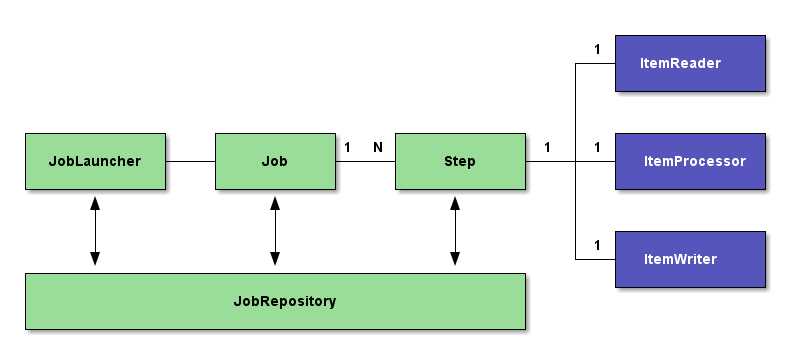

# Spring Batch

<!-- .slide: class="page-title" -->


## Table of content

<!-- .slide: class="toc" -->

- [Clean code](#/1)
- [Testing](#/2)
- [Maven](#/3)
- [Spring Core](#/4)
- [Spring MVC](#/5)
- [Spring Security](#/6)
- [Spring Data](#/7)
- **[Spring Batch](#/8)**
- [Spring Boot](#/9)


## Spring Batch

A framework to create robust batch processes, taking care of the hard boilerplate code for you.

```xml
        <dependency>
            <groupId>org.springframework.batch</groupId>
            <artifactId>spring-batch-core</artifactId>
        </dependency>
```


## Spring Batch

Spring Batch provides

- Transaction management
- Chunk based processing
- Start/Stop/Restart/Retry/Skip
- A toolbox to help you deal with compressed files, csv, etc
- With the usual Spring spirit
  - XML or annotation based configuration
  - Everything is a Spring bean


## The Spring Batch model

<figure>
    
</figure>


## The Spring Batch model: Job and Steps

- A *Job* is the definition of your batch treatment.
- A Job is composed of one or many Steps
- A *Step* is the building block of a Job and can do just about anything
  - Processing an input file
  - Deleting a folder's content
  - Sending a mail


## The Spring Batch model: Steps

- Steps can be of two kinds :
 - *Tasklet* based: Steps may embed an instance of the Tasklet interface 
 - *Chunk-oriented* based: data is **read** sequentially, creating “chunks” which will then be **processed** and **written** back thru a writer
- In both cases, steps are transaction bound


## The Spring Batch model: Tasklet steps

- *Tasklet* is a simple interface 

```java
public interface Tasklet {

	RepeatStatus execute(StepContribution contribution, 
                         ChunkContext chunkContext) 
                 throws Exception;

}
```

- Spring provides a couple available tasklets, but their purpose is generally for you to implement them with whatever task you see fit


## The Spring Batch model: Chunk-oriented steps

- Three building blocks for a chunk-oriented step :
 - The *ItemReader* extracts each individual item from a data source (a file, a database, a queue....)
 - The *ItemProcessor* performs a processing task on the input items, and may convert them to a new type
 - The *ItemWriter* takes the output of the ItemProcessor and writes it back to another data source
- Transactions will typically set up to perform a commit after each chunk
- It's often important to tune the chunk size in order to achieve better performance and reliability


## The Spring Batch model: ItemReader, ItemProcessor, ItemWriter

- Three very simple interfaces
- Spring Batch provides many existing implementations (*JdbcPagingItemReader*, *JmsItemReader*, *JsonItemReader*...)
- Easy to write your own !

```java
public interface ItemReader<T> {
	T read() throws Exception;
}

public interface ItemProcessor<I, O> {
	O process(I item) throws Exception;
}

public interface ItemWriter<T> {
	void write(List<? extends T> items) throws Exception;
}
```


## Putting it all together: Creating a job

Let's make a simple Batch job composed of a tasklet step followed by a chunk step.

```java
@Component
public class MyTasklet implements Tasklet
    @Override
    public RepeatStatus execute(StepContribution sc, ChunkContext cc) {
        ...
        return RepeatStatus.FINISHED;
    }
}

@Configuration
public class CustomerReportJobConfig {

    @Bean
    public Step taskletStep(StepBuilderFactory stepBuilder, 
                            MyTasklet myTasklet) {
        return stepBuilder.get("taskletStep")
            .tasklet(myTasklet)
            .build();
    }

    ...

```


## Putting it all together: Creating a job

```java
    ...

    @Bean
    public Step chunkStep(StepBuilderFactory stepBuilder, 
                            MyReader reader, 
                            MyProcessor processor, 
                            MyWriter writer) {
        return stepBuilder.get("chunkStep")
            .<Customer, Customer>chunk(20)
            .reader(reader)
            .processor(processor)
            .writer(writer)
            .build();
    }

    @Bean
    public Job customerReportJob(JobBuilderFactory jobBuilder) {
        return jobBuilder.get("customerReportJob")
            .start(taskletStep())
            .next(chunkStep())
            .build();
    }
}

```


## Job execution

- A Job is executed by a *JobLauncher*
- Metadata about configured and executed jobs is stored in a *JobRepository*.
- JobRepository may persist data in memory, in a database or any other medium
- Jobs may be passed arguments to parameterize their executions
- It's a good idea to provide an argument with an unique value (eg: execution timestamp) because the JobLauncher refuses to launch a job that has already executed in the past with the exact same parameters


## Job execution

```java
    @Bean
    public JobLauncher jobLauncher(JobRepository jobRepository) throws Exception {
        SimpleJobLauncher jobLauncher = new SimpleJobLauncher();
        jobLauncher.setJobRepository(jobRepository);
        jobLauncher.afterPropertiesSet();
        return jobLauncher;
    }

    @Bean
    public JobRepository jobRepository() {
        return new SimpleJobRepository(
                new MapJobInstanceDao(), 
                new MapJobExecutionDao(), 
                new MapStepExecutionDao(), 
                new MapExecutionContextDao());
    }

    ...

   jobLauncher.run(
        theJob,
        new JobParametersBuilder().addLong("uniqueness", System.nanoTime())
            .toJobParameters()
    );
```


<!-- .slide: class="page-tp9" -->


<!-- .slide: class="page-questions" -->
