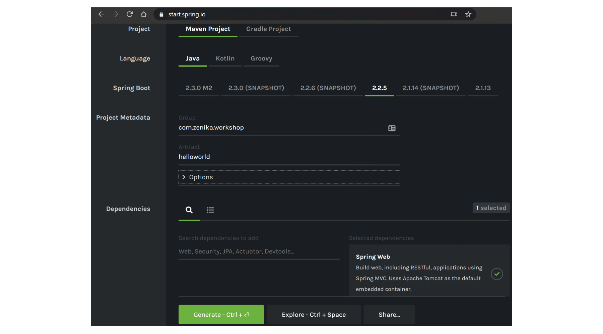

# Spring Boot

<!-- .slide: class="page-title" -->


## Table of content

<!-- .slide: class="toc" -->

- [Clean code](#/1)
- [Testing](#/2)
- [Maven](#/3)
- [Spring Core](#/4)
- [Spring MVC](#/5)
- [Spring Security](#/6)
- [Spring Data](#/7)
- [Spring Batch](#/8)
- **[Spring Boot](#/9)**


## Spring Boot: Spring on steroids

- Spring Boot is Spring's convention-over-configuration solution for creating stand-alone, production-grade Spring-based Applications that you can "just run".
- Helps you get started on your Spring application fast and easy
- Features:
    - Create *stand-alone* Spring applications
    - *Embed Tomcat* or Jetty directly (no need to deploy WAR files)
    - Provide '*starter*' projects to simplify your configuration
    - *Automatically configure* Spring whenever possible
    - Provide production-ready features such as *metrics*, *health checks* and *externalized configuration*
    - No code generation, no requirement for XML configuration


## Spring Boot: A REST application in 10 lines of code
```java
@SpringBootApplication
@RestController
public class HelloWorldApplication {

    public static void main(String[] args) {
        SpringApplication.run(HelloWorldApplication.class, args);
    }

    @GetMapping("/")
    public String helloWorld() {
        return "Hello world";
    }

}
```


## @SpringBootApplication

The *@SpringBootApplication* triggers the automatic configuration of the Spring infrastructure:

- Component scan of every *@Configuration* class or Spring bean present in the current package or a sub-package
- Auto configuration of any Spring Boot starter module present on the classpath


## Spring Initilizr: Your project skeleton in a couple clicks

A website to help you generate your project skeleton: https://start.spring.io

<figure>
    
</figure>


## Stand-alone Spring applications

The *spring-boot-maven-plugin* Maven plugin packages your entire application in a single "fat jar"

- Contains your application and all its dependencies
- Easy to deploy, easy to run
- Can embed a shell script for the jar file to be executable !

```xml
<plugin>
    <groupId>org.springframework.boot</groupId>
    <artifactId>spring-boot-maven-plugin</artifactId>
</plugin>
```


## Spring Boot configuration

- Configuration is centralized in a single application file *application.properties* or *application.yaml* (your choice)
- The configuration file is searched in the classpath or specified thru the commandline:

```shell  
  java -jar myproject.jar 
    --spring.config.location=/opt/myapp/application.yaml
```

- You can also override configuration properties from the command lines

```shell  
  java -jar myproject.jar 
    --spring.config.location=/opt/myapp/application.yaml 
    -Dspring.profiles.active=dev
```


## Embedded application server

When creating a web application, Spring Boot embeds *Tomcat* into your jar

- No need to install Tomcat on your server, the jar file is self sufficient
- The Tomcat configuration is handled thru the Spring Boot configuration file (ports, certificates...)

```yaml
server:
    port: 9080
    ssl:
        enabled: true
        protocol: 'TLS'
...
```


## Embedded application server

- By tweaking Maven dependencies, it's easy to switch to *Jetty* or *Undertow*
- Spring Boot configuration stays the same, it's just a matter of switching dependencies

```xml
<dependency>
	<groupId>org.springframework.boot</groupId>
	<artifactId>spring-boot-starter-web</artifactId>
	<exclusions>
		<exclusion>
			<groupId>org.springframework.boot</groupId>
			<artifactId>spring-boot-starter-tomcat</artifactId>
		</exclusion>
	</exclusions>
</dependency>
<dependency>
	<groupId>org.springframework.boot</groupId>
	<artifactId>spring-boot-starter-jetty</artifactId>
</dependency>
```


## Starter modules

- Starter modules are technical modules to add functionnalities to a Spring Boot application
- There are starter modules for every aspect of your application
  - Web: *spring-boot-starter-web*
  - Persistence:  *spring-boot-starter-data-jpa*
  - Security: *spring-boot-starter-security*
  - Utilities: *spring-boot-starter-logging*
  - And many many more, provided by Spring or third parties


## Starter modules

Using a starter module is easy: 

- Just include it in your pom.xml
- Spring Boot will autodetect and autoconfigure it on startup
  - Starters set up reasonable defaults and are ready-to-good
  - Customization is done thru properties in your configuration file or thru *@Bean* files you can provide

```xml
<dependency>
	<groupId>org.springframework.boot</groupId>
	<artifactId>spring-boot-starter-web</artifactId>
</dependency>
```


## Starter modules: Write your own !

It's very easy to write your own Spring Boot Starter

- Write a regular Java module with Spring components and any code you want
- Write a manifest file *META-INF/spring.factories* where you will declare any *@Configuration* class that need taking into account

```properties
# Auto Configure
com.zenika.mystarter.persistence.MyFirstAutoConfiguration=\
com.zenika.mystarter.business.AnotherAutoConfiguration
```

- That's it ! When your starter module is included as a dependency, Spring Boot will discover it automatically and include your *@Configuration*s


## Production-ready features: Spring Boot Actuator

- Spring Boot includes a number of additional features to help you monitor and manage your application when you push it to production
- You can choose to manage and monitor your application by using HTTP endpoints or with JMX
- Auditing, health, and metrics gathering can also be automatically applied to your application
- The *spring-boot-actuator* module provides all of Spring Boot’s production-ready features

```xml
<dependency>
    <groupId>org.springframework.boot</groupId>
    <artifactId>spring-boot-starter-actuator</artifactId>
</dependency>
```


## Production-ready features: Spring Boot Actuator

- Spring Boot Actuator automatically adds many REST endpoints to monitor your application
  - */actuator/health* exposes wether your application is up and running. Very useful for supervision !
  - */actuator/beans* exposes a list of Spring Components. Useful for troubleshooting during developement
  - */actuator/metrics* displays your application metrics
  - */actuator/shutdown* gracefully terminates the application
  - and many more !

- Not all endpoints are activated by default. Enable them in your application.yaml configuration

```yaml
management.endpoint.shutdown.enabled: true
```


<!-- .slide: class="page-tp11" -->


<!-- .slide: class="page-questions" -->
